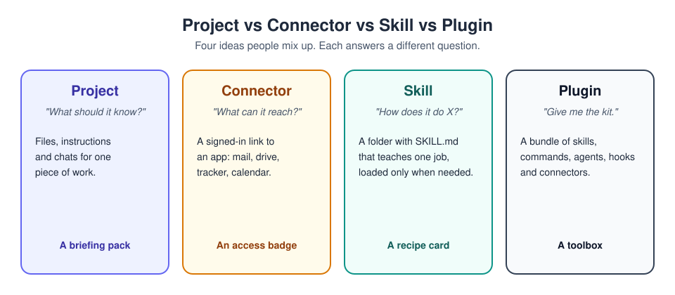

# Claude Tutorial: from first chat to Claude Code

A free, practical, step-by-step guide to using **Claude**, Anthropic's AI
assistant. It starts with your first chat and goes all the way to
automating software work with Claude Code. Every chapter has
explanations, diagrams and a hands-on exercise.

> **Current as of September 2026.** Claude changes quickly. Menu names and
> plan details may differ slightly in your app. If something here is out
> of date, please open an issue or a pull request.

## Who this is for

- **Beginners** who have never used an AI assistant.
- **Regular users** who want projects, connectors, skills and Cowork to
  do real work for them.
- **Developers** who want to use Claude Code in the terminal, VS Code,
  JetBrains (IntelliJ) or Visual Studio.

## Contents

### Part 1 - Beginner
1. [Getting started](docs/01-getting-started.md) - surfaces, plans, the latest UI, models and effort
2. [Chat and prompting](docs/02-chat.md) - how to write a brief that gets a great answer
3. [Artifacts and real files](docs/03-artifacts.md) - shareable pages, Word, Excel, PowerPoint, PDF
4. [Projects, instructions and memory](docs/04-projects.md) - stop re-explaining yourself
5. [Connectors (MCP)](docs/05-connectors.md) - let Claude reach your apps, safely
6. [Hallucinations](docs/06-hallucination.md) - why it can be confidently wrong, and how to prevent it

### Part 2 - Intermediate
7. [Cowork](docs/07-cowork.md) - hand over multi-step tasks, scheduled tasks, Claude in Chrome
8. [Skills](docs/08-skills.md) - teach Claude a procedure once
9. [Plugins](docs/09-plugins.md) - install or build a whole toolkit

### Part 3 - Advanced (Claude Code)
10. [Claude Code](docs/10-claude-code.md) - install, first session, commands, MCP, hooks, subagents
11. [IDE integration](docs/11-ide-integration.md) - VS Code, JetBrains / IntelliJ, Visual Studio
12. [Plan mode and permissions](docs/12-plan-mode.md) - stay in control of what Claude does
13. [CLAUDE.md files and their types](docs/13-claude-md.md) - managed, user, project, local, subfolder, rules, imports
14. [Routines and scheduled work](docs/14-routines.md) - cloud routines, desktop tasks, /loop

### Part 4 - Practice and reference
15. [Practice: twelve hands-on exercises](docs/15-practice.md)
16. [Quick reference](docs/16-quick-reference.md) - cheat sheets, templates, file locations

## How the pieces fit together

## How to use this guide

- **Short on time?** Read chapters 2 and 6. They will improve every
  conversation you have.
- **Learning by doing?** Jump to the [practice exercises](docs/15-practice.md)
  and follow the links back when you need the background.
- **Developer?** Skim part 1, then read part 3 in order.

## Contributing

Corrections and improvements are welcome:

1. Fork the repository and create a branch (`docs/fix-typo-chapter-3`).
2. Make your change. Please keep text in plain ASCII Markdown and credit
   any image you add in [CREDITS.md](CREDITS.md). Only use images you have
   the right to share.
3. Open a pull request describing what changed and why.

## Disclaimer

This is an independent, community tutorial. It is **not** affiliated with,
endorsed by, or sponsored by Anthropic. "Claude", "Claude Code" and
"Anthropic" are trademarks of Anthropic, PBC, used here only to identify
the product being described. For authoritative information, see the
[official documentation](https://code.claude.com/docs) and
[help centre](https://support.claude.com).

## Licence

Text and diagrams: [MIT](LICENSE). Photos are hotlinked from Unsplash
under the [Unsplash License](https://unsplash.com/license); see
[CREDITS.md](CREDITS.md).
