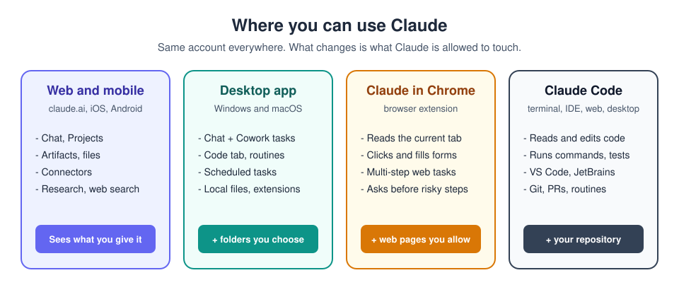

# 1. Getting started

[Home](../README.md) | Next: [Chat and prompting](02-chat.md)

Photo: Chris Ried on Unsplash

## What Claude is (and is not)

Claude is an AI assistant made by Anthropic. You talk to it in plain
language; it reads what you give it and writes something back: an answer,
a draft, a table, a real file, a small app, or a change to your code.

Three common misunderstandings:

- **"It's a smarter search box."** Search hands you pages to read; Claude
  does the reading and produces something new. (It can also search the
  web, and it cites what it found.)
- **"It can see my stuff."** Only what you share with it: an attachment,
  a folder you pick, an app you connect. Nothing else.
- **"It knows best."** It knows a lot in general and nothing about your
  particular situation until you explain it. The final call stays yours.

## The places you can use it

| Surface | Get it | Best for |
|---|---|---|
| Web | [claude.ai](https://claude.ai) | Quick questions, drafts, files, research. Nothing to install. |
| Mobile | iOS / Android app | The same chats on the go, voice input. |
| Desktop app | [claude.com/download](https://claude.com/download) (Windows, macOS) | Everything on the web **plus** local folders, desktop extensions, Cowork and the Code tab. |
| Claude in Chrome | Chrome Web Store (paid plans) | Letting Claude read a web page, click and fill forms for you. |
| Claude Code | Terminal, VS Code, JetBrains, desktop, web | Software work inside a real code repository. |

**The pattern:** each step down the table lets Claude reach a little more.
The web app works with what you upload, the desktop app can open folders
you allow, Cowork can carry out a sequence of steps, and Claude Code works
inside a software project.

## Plans in one paragraph

There is a **Free** plan, individual paid plans (**Pro**, and **Max** with
more usage), and business plans (**Team**, **Enterprise**). Free covers
chat, files, artifacts, projects (a limited number), skills and connectors.
Paid plans add things like Research, Cowork, scheduled tasks, Claude in
Chrome, plugins and Claude Code routines. Prices and limits change: check
[claude.com/pricing](https://claude.com/pricing) for the current details.

> **Privacy tip:** read the privacy settings for your plan
> (Settings > Privacy) so you know whether your chats may be used to improve
> models, and choose what you are comfortable with. On business plans your
> organisation's admin controls this.

## Step by step: your first five minutes

1. Go to [claude.ai](https://claude.ai) and sign up with your email or a
   Google account. You will get a one-time code by email.
2. Answer the short welcome questions (your name, what you use it for).
3. You land on the home screen. Find these parts of the screen:
   - **Left sidebar:** New chat, Recents, Projects, Artifacts, Scheduled,
     Customize, Code. (Older layouts show Chats instead of Recents, and
     may not have Scheduled.)
   - **Message box** in the centre, with a **+** button on the left (attach
     files, connectors, research, skills) and the **model and effort
     picker** next to the send button.
   - **Your account** at the bottom left: Settings, plan, help.
4. Type: `In three sentences, what can you help me with today?` and press
   Enter.
5. Optional: install the desktop app from
   [claude.com/download](https://claude.com/download) and sign in with the
   same account. Your chats appear there too.

> **About the latest UI:** in 2026, Anthropic began merging *Chat* and
> *Cowork* into a single conversation, rolling out gradually. If your app
> still shows separate **Chat / Cowork / Code** tabs at the top, you have
> the earlier layout. Everything in this tutorial works in both; we point out
> where the two differ.

## Choosing a model and effort

Click the model name next to the send button.

| Model family | Think of it as |
|---|---|
| **Haiku** | Fast and light. Simple, high-volume jobs. |
| **Sonnet** | The everyday workhorse. Balanced speed and quality. |
| **Opus** | Deep reasoning for hard, messy or high-stakes work. |
| **Fable** | Anthropic's top tier, for the genuinely hardest problems (where your plan includes it). |

**Effort** (Low, Medium, High, Extra high, Max) controls how much Claude
thinks before answering. Higher effort is slower and uses more of your
allowance. It makes answers more thorough, not automatically more correct.
Start on the default and only go up when a task is genuinely hard.

## Key words you will meet

| Word | Meaning |
|---|---|
| Prompt | The message you send. |
| Context | Everything Claude can see in this conversation: your messages, files, instructions. |
| Artifact | A result that opens as its own page: a document, chart, app. |
| Project | A workspace that remembers files and instructions for one piece of work. |
| Connector | A signed-in link to another app (mail, drive, tracker). |
| Skill | A saved procedure Claude follows for one type of job. |
| Plugin | A bundle of skills, connectors and more, installed together. |
| Cowork | Claude doing a multi-step task for you, with files and apps. |
| Hallucination | A confident statement that is not true. |

---
[Home](../README.md) | Next: [Chat and prompting](02-chat.md)
