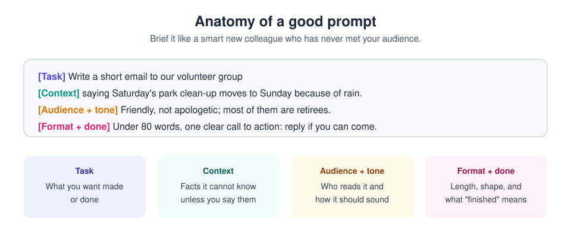

# 2. Chat and prompting

[Home](../README.md) | Previous: [Getting started](01-getting-started.md) | Next: [Artifacts and files](03-artifacts.md)


<sub>Photo: Nathan Dumlao on Unsplash</sub>

Chat is the simplest way to use Claude: type a message, get a reply. Most
weak answers come from missing information, not from a weak model.

## Write a clear brief



Claude only knows what is in the conversation. Anything in your head
(who the reader is, what happened last week, what you already tried) has to
be written down. A useful checklist:

1. **Task** - what you want made or done.
2. **Context** - the facts they cannot know unless you say them.
3. **Audience and tone** - who reads it, how it should sound.
4. **Format and "done"** - length, structure, file type, what finished looks like.

### Before and after

| Vague | Specific |
|---|---|
| `Give me a workout plan.` | `I'm 45, a beginner, and have 30 minutes on Monday, Wednesday and Friday with only a pair of dumbbells at home. Give me a 4-week plan that builds up gradually, as a table, with one sentence on form for each exercise.` |
| `Explain recursion.` | `Explain recursion to a 14-year-old who knows basic Python loops. Use one everyday analogy, then a 6-line code example, then a common mistake to avoid. Under 250 words.` |
| `Help with my cover letter.` | `Here is a job ad and my CV. Write a cover letter under 300 words that links my two most relevant projects to their top three requirements. Confident, not boastful. Don't invent any experience that isn't in my CV.` |

The longer versions are not "prompt engineering". They simply include
the facts, the reader and the finish line that the short versions left out.

## Iterate on the answer

Treat the first reply as version one and give feedback on it, the way you
would with a human draft:

- `Too long. Three bullets.`
- `The second paragraph is too apologetic - make it confident.`
- `You missed the budget point. Add it before the conclusion.`
- `Good. Now make a version for a non-technical reader.`

Quick, specific feedback is usually faster than trying to write the
perfect prompt up front.

## Question-first: let Claude ask you

You do not have to write the perfect brief yourself. For anything bigger
than a quick question, flip it around: give a short description and ask
Claude to **interview you** before it starts. It will ask about things
you had not thought to mention.

```text
I want to plan a two-week trip to Japan in April for two people.
Before suggesting anything, ask me the questions you need answered to make
a great plan - one short batch at a time, most important first. Don't
propose an itinerary until I say "go".
```

Variations worth keeping:

- **Clarify first:** `Before you answer, ask me up to 3 questions if
  anything important is unclear. If nothing is, just answer.`
- **Interview, then summarise:** `Interview me about this project until you
  understand it, then write a one-page brief I can reuse.` Save that brief in
  a [project](04-projects.md) so you never repeat the interview.
- **Check understanding:** `Before starting, restate the task in your own
  words and list your assumptions.`
- **Improve my prompt:** `Here is a prompt I plan to use. Point out anything
  ambiguous and rewrite it to be clearer.`

In Claude Code the same idea is the "interview me, then write a spec"
workflow ([chapter 10](10-claude-code.md#workflows-that-work)).

## Techniques from Anthropic's prompting guide

When a plain brief is not enough, these techniques from Anthropic's
[prompting best practices](https://platform.claude.com/docs/en/build-with-claude/prompt-engineering/claude-prompting-best-practices)
make the biggest difference:

| Technique | What to do | Example |
|---|---|---|
| **Be explicit** | Ask for what you want, including "above and beyond" if you want it. A useful test: would a colleague with no background understand your prompt? | `Make it a complete, polished version, not a minimal draft.` |
| **Explain why** | Give the reason behind a rule; Claude generalises from it. | `Keep sentences short - this will be read aloud to children.` |
| **Show examples** | Two to five varied examples steer format and tone better than a description. Wrap them in tags. | `<example>Q: ... A: ...</example>` |
| **Structure with tags** | Separate instructions, context and input with XML-style tags so nothing gets mixed up. | `<instructions>...</instructions> <report>...</report>` |
| **Give a role** | One sentence on who Claude should be focuses tone and depth. | `You are an experienced primary-school teacher.` |
| **Long material first** | Put long documents at the top and your question at the end. | *(paste report)* `... Now: what are the three biggest risks?` |
| **Ask for thinking** | For hard problems, ask it to reason before answering (or raise the effort level). | `Work through this step by step, then give a short answer.` |
| **Chain steps** | Split a big job into a sequence of prompts, each using the last result. | Outline, then draft, then critique, then final. |
| **Say what to do, not only what not to do** | Positive instructions are followed more reliably. | `Write in flowing paragraphs` beats `No bullet points`. |

A template that combines several of these:

```text
<role>You are a careful financial analyst writing for non-experts.</role>

<context>
I run a small bakery. Attached are last year's monthly sales and costs.
I'm deciding whether to open on Sundays.
</context>

<instructions>
1. Ask me up to 3 questions first if anything important is missing.
2. Then estimate the likely monthly profit or loss of Sunday opening.
3. Show your assumptions in a table, and mark anything you inferred.
4. Finish with a one-paragraph recommendation.
</instructions>
```

Want to practise further? Anthropic publishes a free
[interactive prompting tutorial](https://github.com/anthropics/prompt-eng-interactive-tutorial).

## Tools inside the message box

Click **+** at the bottom left of the message box:

| Option | What it does |
|---|---|
| **Add files or photos** | Attach PDFs, Word/Excel files, images, CSVs. You can also drag and drop. |
| **Connectors** | Toggle which connected apps this chat may use (see [chapter 5](05-connectors.md)). |
| **Research** | A deeper, multi-search investigation that returns a cited report (paid plans; takes a few minutes). You can also type `/deep-research`. |
| **Web search** | Lets Claude look things up. In the latest UI it runs automatically when helpful. |
| **Skills** | Pick a skill to use explicitly (see [chapter 8](08-skills.md)). |

Next to the send button:

- **Model picker** - choose Haiku, Sonnet, Opus or Fable.
- **Effort** - hover over it to set Low to Max, and toggle extended
  **Thinking** on models that allow switching it off.

## Other chat features worth knowing

- **Incognito chat** - click the ghost icon at the top of a new chat. It is
  not saved to your history or memory. Useful for one-off, sensitive
  questions.
- **Memory** - Claude can remember useful things about you across chats.
  Manage it under **Settings > Memory** (see and delete what it remembers)
  and **Settings > Capabilities**.
- **Instructions for Claude** - your standing preferences ("British
  English, be concise, no emojis"). In the latest UI they live in
  **Settings > General**; older layouts have them under your profile.
- **Starring chats** - star a conversation that went well so you can find
  and reuse it.
- **Voice** - on mobile and desktop you can dictate or have a voice
  conversation.

## What goes in, and what should not

A sensible default is to share only what you would be comfortable
putting in any online service:

- Fine: your own drafts, public information, made-up examples.
- Think twice: other people's personal details, anything confidential,
  passwords, bank details, medical records.
- Never paste secrets such as passwords or API keys.

## Try it now (5 minutes)

1. Open a new chat and send the thin prompt: `Write a birthday message.`
2. Now send a proper brief: `Write a birthday message for my neighbour
   Sam, who is turning 70 and loves gardening. Warm, a little funny, two
   sentences, to go in a card.`
3. Correct it: `Less formal, and mention tomatoes.`
4. Compare the three results. That gap is the whole lesson.

---
[Home](../README.md) | Previous: [Getting started](01-getting-started.md) | Next: [Artifacts and files](03-artifacts.md)
