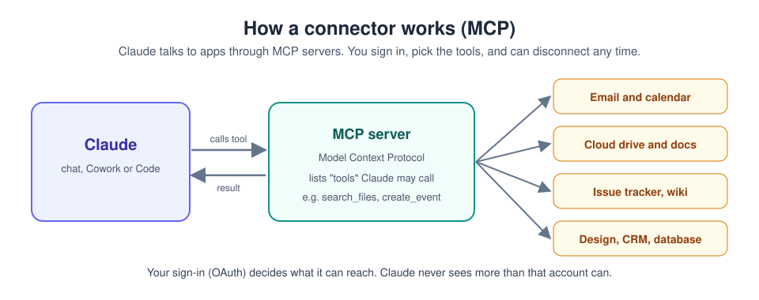

# 5. Connectors (MCP)

[Home](../README.md) | Previous: [Projects and memory](04-projects.md) | Next: [Hallucinations](06-hallucination.md)

Photo: Hans-Peter Gauster on Unsplash

By default Claude only sees what you paste or attach. A **connector** is a
signed-in link to another app, so Claude can read from it (and, if you
allow, act in it) directly: your email, calendar, cloud drive, notes, task
board, design tool or database.

## How it works

Connectors are built on the **Model Context Protocol (MCP)**, an open
standard. An MCP server offers a list of *tools* (for example
`search_messages`, `create_event`). Claude decides when to call them and
shows you when it does. Because it is a standard, any app can offer one.

Key points:

- **You sign in** to the other app (usually OAuth). Claude can only reach
  what that account can reach.
- **You choose per chat** which connectors are switched on.
- **Read vs write:** many connectors can also create or change things
  (send, create, update). Claude should ask before doing anything
  outward-facing, and you can restrict tools in the connector's settings.

## Add a connector, step by step

1. Click **+** in the message box > **Connectors** > **Manage connectors**
   (or go to **Customize > Connectors**).
2. Click **+** to browse the **Connectors Directory**, search for your app
   and click **Connect**.
3. Sign in to that app and approve the permissions it asks for.
4. Back in a chat, click **+** > hover **Connectors** and make sure the
   toggle is **on** for this conversation.
5. Ask something that needs it, for example: `Look at my calendar for
   next week and list any day with more than 4 hours of meetings.`

On Team/Enterprise plans an admin enables connectors for the organisation
first (Organization settings > Connectors); you then connect your own
account.

## Custom connectors

If the app you want is not in the directory but offers a remote MCP
server URL:

1. **Customize > Connectors > + > Add custom connector.**
2. Paste the server URL (and OAuth details if the provider gave you any).
3. Click **Add**, then **Connect**.

Only add servers from providers you trust. A connector can see whatever its
tools return, and a malicious one could try to feed Claude misleading
instructions. The Free plan allows one custom connector.

## Desktop extensions (local connectors)

The desktop app can also run **local** MCP servers packaged as desktop
extensions (`.mcpb` files; older ones are `.dxt`). These run on your
computer, for example to reach local files or apps. Install from
**Settings > Extensions** (browse, or *Advanced settings > Install
Extension...* for a file you trust).

## Good habits

- **Least privilege.** Connect the apps you actually need, and grant the
  narrowest access the provider offers. You can always add more later.
- **Per-chat toggles.** Turn on only the connectors relevant to the
  current conversation. Claude picks tools more reliably from a short list.
- **Ask across sources.** Connectors shine when a question spans apps, for
  example: `Compare the deadlines in my task list with my calendar and
  tell me where they clash.`
- **Review before anything leaves.** For emails, posts or edits to shared
  documents, ask for a draft first and check it yourself.
- **Revoke what you stop using** from Customize > Connectors, and in the
  other app's security settings.

## Try it now (10 minutes)

1. Connect a **calendar** (Google Calendar or Outlook, whichever you use).
2. In a new chat with only that connector on, ask:
   `Look at my next 7 days. Which day is the busiest, where are my free
   blocks of 2 hours or more, and is anything double-booked?`
3. Follow up: `Suggest the best slot for a 90-minute focus session each
   day, but don't create any events.`
4. **Done when:** the answer matches what you see in your calendar, and
   nothing was added or changed. Then try: `Create one of those as a
   tentative event called "Focus time".` Claude should ask you to confirm
   first.

---
[Home](../README.md) | Previous: [Projects and memory](04-projects.md) | Next: [Hallucinations](06-hallucination.md)
