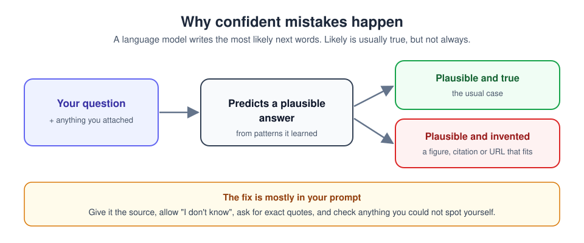

# 6. Hallucinations: when it is confidently wrong

[Home](../README.md) | Previous: [Connectors](05-connectors.md) | Next: [Cowork](07-cowork.md)


<sub>Photo: Markus Winkler on Unsplash</sub>

"Hallucination" is the name for an AI stating something false as if it were
fact: an invented statistic, a book that does not exist, a misquoted
sentence, a broken link. Modern Claude models do this far less than early
chatbots did, but it still happens, so it pays to know when to double-check.

## Why it happens



A language model generates text by predicting what should come next, based
on patterns from its training and whatever is in the conversation. When
the conversation contains the answer, prediction and truth line up. When
it does not, the model can still produce text that *sounds* like an answer,
and the sound of it gives no hint that it is made up.

## Things to be careful with

- **Specific numbers** it was not given: prices, percentages, dates, sizes.
- **References**: article titles, authors, page numbers, legal or
  regulatory section numbers, product model numbers.
- **Quotations**: a paraphrase presented as a direct quote can quietly
  change the meaning.
- **Niche or recent facts**: small organisations, local rules, very recent
  events.
- **URLs**: a well-formed link can point nowhere.

A useful test: **how would I know if this were wrong?** If you could not
tell, check it before relying on it.

## Red flags

- Precise detail with no source attached.
- A citation you cannot find when you look for it.
- An answer that simply agrees with the assumption built into your
  question.
- Names, dates or figures that differ when you ask the same thing twice.

## Techniques that help

Anthropic's own guide,
[Reduce hallucinations](https://platform.claude.com/docs/en/test-and-evaluate/strengthen-guardrails/reduce-hallucinations),
recommends these. Here is how to use them in everyday chats:

| Technique | Say something like |
|---|---|
| **Ground it in a source.** Attach the document or turn on web search. | `Answer using only the attached PDF.` |
| **Allow uncertainty.** Tell it that "I don't know" is acceptable. | `If the document doesn't cover this, say so.` |
| **Quotes first.** For long documents, have it extract exact quotes, then answer from them. | `First list the exact sentences that are relevant, then answer.` |
| **Cite and retract.** Each claim needs supporting text, or it is removed. | `Support each point with a quote. Remove any point you can't support.` |
| **Think it through.** Ask for reasoning before the conclusion. | `Explain your reasoning step by step, then give the answer.` |
| **Compare runs.** Ask twice (in fresh chats) and compare. | Different answers mean you need a source. |
| **Critique.** Ask it to find problems with its own answer. | `Check your answer above for errors or unsupported claims.` |

And do the maths yourself for anything that matters: give Claude the input
numbers, and let it do the working, which you can check.

## Try it now (8 minutes)

This exercise shows the difference grounding makes.

1. In a new chat, **without** attaching anything, ask:
   `Who won the 1987 Bramblewick Village baking contest, and what did they bake?`
   (The village and contest are invented.) Notice whether Claude says it has
   no information or makes something up. Current models usually decline.
2. Now paste this fictional notice:

   ```text
   BRAMBLEWICK VILLAGE HALL - NOTICE (fictional)
   The summer fete is on Saturday 12 July, 10:00 to 16:00.
   Stalls cost 15 per table; book with the hall committee by 30 June.
   Dogs on leads are welcome. No barbecues on the green this year.
   ```

   Ask: `From this notice only: how much is a stall, what is the booking
   deadline, and is there a parking fee? Quote the line for each answer. If
   something isn't mentioned, say NOT MENTIONED.`
3. **Done when:** it quotes the price and deadline lines, and says NOT
   MENTIONED for parking instead of guessing.
4. Bonus: ask `Check your last answer for anything not directly supported
   by the notice.`

---
[Home](../README.md) | Previous: [Connectors](05-connectors.md) | Next: [Cowork](07-cowork.md)
