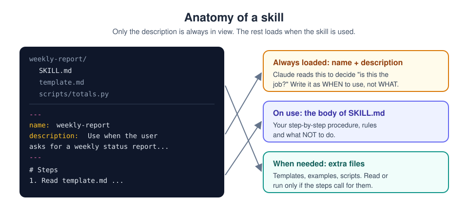

# 8. Skills: teach it once, reuse forever

[Home](../README.md) | Previous: [Cowork](07-cowork.md) | Next: [Plugins](09-plugins.md)


<sub>Photo: Barn Images on Unsplash</sub>

Instructions and projects tell Claude *about* you and your work. A
**skill** tells Claude *how to do a particular job*, step by step, in a
repeatable way: your checklist for reviewing a pull request, your format
for trip itineraries, your process for turning lecture notes into flashcards.

A skill is a folder with a `SKILL.md` file: instructions, plus optional
templates, examples and scripts. Claude sees only the skill's **name and
description** until a task matches; then it loads the full instructions.
That means you can have many skills without cluttering every chat.


## Anatomy of a skill



```markdown
---
name: weekly-report
description: Use when the user asks for a weekly status report, weekly
  update or "what did I do this week" summary, even if they just say
  "do my weekly". Not for monthly or quarterly reports.
---

# Weekly report

1. Ask for (or read) this week's notes if none were provided.
2. Use the structure in template.md: Done, In progress, Blocked, Next week.
3. Maximum 150 words. Plain English, no jargon.
4. Blocked items must name who or what they are waiting on.
5. Never invent progress that isn't in the notes; write "no update" instead.
```

### Write the description for matching

Claude decides whether to load a skill by comparing your request with the
skill's description. So describe the **situations and phrases** that
should trigger it:

- Better: `Use when the user wants flashcards, a quiz or revision questions
  from notes, slides or a textbook chapter, including requests like "help me
  revise this".`
- Worse: `Flashcard generator.`

If the skill keeps firing on the wrong requests, add a short "Not for..."
sentence to the description.

## Skills in the Claude app

1. Make sure **Settings > Capabilities > Code execution and file creation**
   is on.
2. Go to **Customize > Skills**. You will see built-in skills (for Word,
   Excel, PowerPoint and PDF files, which Claude uses automatically) and
   any you add.
3. To add one: **+ > Create skill**. Either:
   - **Create with Claude** - describe the job and answer its interview
     questions (Anthropic's *skill-creator* skill does exactly this), or
   - **Upload a skill** - a `.zip` containing a folder with `SKILL.md`.
4. To use one: just describe the task (Claude reads descriptions to decide),
   or pick it explicitly from **+ > Skills**.
5. On Team/Enterprise plans, admins can publish skills to everyone.

## Skills in Claude Code

| Scope | Location | Available |
|---|---|---|
| Personal | `~/.claude/skills/<name>/SKILL.md` | All your projects on this machine |
| Project | `.claude/skills/<name>/SKILL.md` | Everyone who clones the repo (commit it) |
| Plugin | `<plugin>/skills/<name>/SKILL.md` | Wherever the plugin is enabled, as `/plugin-name:skill-name` |

Each skill also becomes a slash command: `/weekly-report`. Useful
frontmatter fields include:

| Field | Purpose |
|---|---|
| `name` | Command name (defaults to the folder name). |
| `description` | When to use it. Claude uses this to decide. |
| `disable-model-invocation: true` | Only you can run it with `/name`; Claude will not trigger it on its own. |
| `user-invocable: false` | Background knowledge only Claude uses; hidden from the `/` menu. |
| `allowed-tools` | Tools it may use without asking during that turn. |
| `argument-hint` | Autocomplete hint such as `[issue-number]`. |
| `paths` | Only activate when working on matching files. |
| `model`, `effort` | Override the model or effort while the skill runs. |

Full reference: [code.claude.com/docs/en/skills](https://code.claude.com/docs/en/skills).

## Test it

Check two things: that the output is right, and that it activates at the
right times.

1. Write a small test list: a handful of requests that should use the
   skill (worded differently each time) and a few similar-sounding ones that
   should not.
2. Run each in a fresh chat and note whether the skill was used (Claude
   shows when it loads a skill).
3. Adjust the description, and re-test until the list passes.

For Claude Code plugins, `claude plugin eval` can automate this kind of
check.

## Ideas for a first skill

- **Flashcards from notes** - question/answer pairs, difficulty tags,
  exported as CSV for a flashcard app.
- **Trip itinerary** - a day-by-day table with travel times, costs and a
  packing list, always in the same layout.
- **Code review checklist** - your team's rules for tests, naming, error
  handling and security, applied the same way every time.
- **Recipe scaler** - scale any recipe to N servings and convert to metric.

Good candidates are tasks you do regularly, with a consistent format, where
you find yourself pasting the same instructions again.

---
[Home](../README.md) | Previous: [Cowork](07-cowork.md) | Next: [Plugins](09-plugins.md)
