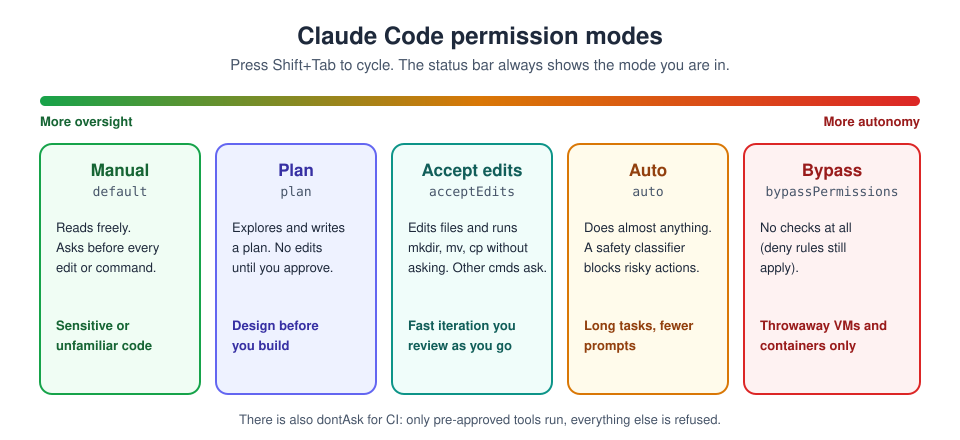
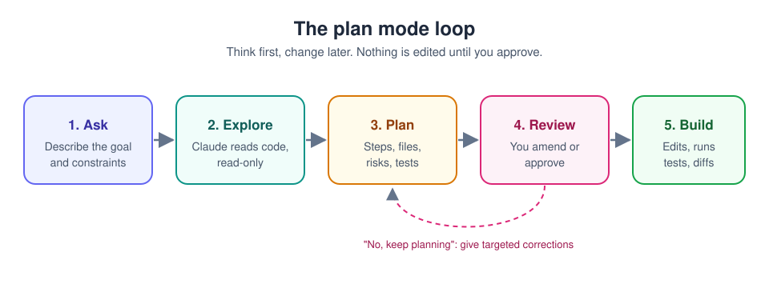

# 12. Plan mode and permissions

[Home](../README.md) | Previous: [IDE integration](11-ide-integration.md) | Next: [CLAUDE.md files](13-claude-md.md)


<sub>Photo: Glenn Carstens-Peters on Unsplash</sub>

A **permission mode** decides what Claude Code may do on your machine
without asking first. Knowing which mode you are in, and when to switch, is
the most important safety habit in Claude Code.

## The modes



| Mode (setting value) | Runs without asking | Use for |
|---|---|---|
| **Manual** (`default`) | Reads only | Sensitive work, unfamiliar code, anything you want to see step by step |
| **Plan** (`plan`) | Reads and exploration; no source edits until you approve | Designing a change before making it |
| **Accept edits** (`acceptEdits`) | Reads, file edits, simple filesystem commands (`mkdir`, `mv`, `cp`...) | Fast iteration on code you are actively reviewing |
| **Auto** (`auto`) | Almost everything; a safety classifier reviews and blocks risky actions | Long tasks where constant prompts get in the way |
| **Don't ask** (`dontAsk`) | Only pre-approved tools; everything else is refused | Locked-down scripts and CI |
| **Bypass** (`bypassPermissions`) | Everything | Isolated, disposable containers or VMs only |

Recent versions start interactive sessions in **auto**. Drop to Manual or
plan deliberately when the work matters.

### Switching

- **Terminal / JetBrains:** `Shift+Tab` cycles Manual > accept edits >
  plan (> auto). The status bar shows e.g. `plan mode on`.
- **VS Code and desktop app:** the mode selector in the prompt box.
- **At launch:** `claude --permission-mode plan`
- **One request only:** start the prompt with `/plan`.
- **Default for a project:** `"permissions": { "defaultMode": "plan" }` in
  `.claude/settings.json`.

## Plan mode, step by step



1. Switch to plan mode (`Shift+Tab` until you see `plan mode on`).
2. Describe the goal **and the constraints**:

   ```text
   Add a /health endpoint that returns build version and DB status,
   plus a test. Don't change the existing routes. Show me the files you'd
   touch and the risks before writing anything.
   ```

3. Claude explores the code (read-only) and writes a plan.
4. **Review it** (see below). Then choose one of:
   - **Yes, and use auto mode** (or **Yes, auto-accept edits**) - approve
     and let it build.
   - **Yes, manually approve edits** - approve, but confirm each edit.
   - **No, keep planning** - tell it what to change.
5. Claude builds, runs the tests and shows the diff. Review before you
   commit.

### Reviewing a plan: questions to ask

- **Scope:** do the files and steps match what you asked for, no more and
  no less?
- **Approach:** is this how you (or your team) would do it? Does it reuse
  existing code, or reinvent it?
- **Tests:** how will you know it works? Is there a test step?
- **Risk:** what could this break? Migrations, public APIs, config and
  anything touching security deserve extra attention.
- **Feedback:** choose **No, keep planning** and give targeted
  corrections, for example `Use the existing Logger class instead of a new
  one, and skip the README change.` In VS Code you can comment directly on
  the plan document.

## Permission rules

Modes set the baseline; **rules** fine-tune it. Put them in
`.claude/settings.json` (shared with the team) or `~/.claude/settings.json`
(just you):

```json
{
  "permissions": {
    "allow": [
      "Bash(npm run test *)",
      "Bash(git status)",
      "Bash(git diff *)"
    ],
    "ask": [
      "Bash(git push *)"
    ],
    "deny": [
      "Read(./.env)",
      "Read(./secrets/**)",
      "Bash(curl *)"
    ]
  }
}
```

- **allow** - runs without asking.
- **ask** - always asks, even in auto mode.
- **deny** - never allowed, in **every** mode, including bypass. This is
  the right place to write "never do this here".

Manage them interactively with `/permissions`.

## Safety checklist

- Work in a **git repository on a branch**, so everything can be reverted.
- Use **plan mode** for anything non-trivial: new features, refactors,
  multi-file changes, anything security-related.
- **Deny reads of secrets** (`.env`, key files) so they are never sent.
- Practise restoring with `/rewind` (or `Esc Esc`) on a test repo, so recovery is familiar.
- Only use **bypass** inside a throwaway container with nothing valuable
  mounted.

---
[Home](../README.md) | Previous: [IDE integration](11-ide-integration.md) | Next: [CLAUDE.md files](13-claude-md.md)
