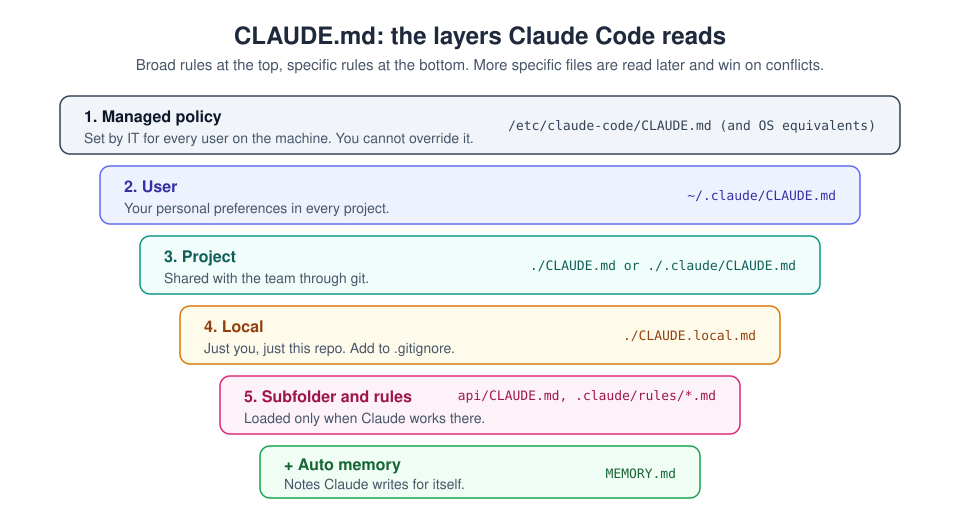

# 13. CLAUDE.md files and their types

[Home](../README.md) | Previous: [Plan mode and permissions](12-plan-mode.md) | Next: [Routines](14-routines.md)


<sub>Photo: Susan Q Yin on Unsplash</sub>

`CLAUDE.md` is a plain Markdown file that Claude Code reads at the start of
every session. It is where you write what a new team member would need to
know: how to build and test, the conventions, and the traps. It is the
single biggest lever on the quality of Claude Code's work.

> CLAUDE.md is **guidance**: Claude reads it and tries to follow it. For
> things that must *always* happen or *never* happen, use
> [permission rules](12-plan-mode.md#permission-rules) or
> [hooks](10-claude-code.md#subagents-and-hooks-briefly), which are enforced.

## The types (and where they live)



| Type | Location | Who it affects | Commit to git? |
|---|---|---|---|
| **Managed policy** | macOS: `/Library/Application Support/ClaudeCode/CLAUDE.md`<br>Linux/WSL: `/etc/claude-code/CLAUDE.md`<br>Windows: `C:\Program Files\ClaudeCode\CLAUDE.md` | Every user on the machine; set by IT | No (deployed by admins) |
| **User** | `~/.claude/CLAUDE.md` | You, in every project | No |
| **Project** | `./CLAUDE.md` or `./.claude/CLAUDE.md` | Everyone working on the repo | **Yes** |
| **Local** | `./CLAUDE.local.md` | You, in this repo only | No (add to `.gitignore`) |
| **Subdirectory** | e.g. `api/CLAUDE.md` | Loaded when Claude works in that folder | Usually yes |
| **Rules** | `.claude/rules/*.md` | Always, or only for matching file paths | Yes |
| **Auto memory** | `~/.claude/projects/<project>/memory/MEMORY.md` | Notes Claude writes for itself | No |

### How they combine

- Claude Code walks up from the folder you started in and loads every
  `CLAUDE.md` (and `CLAUDE.local.md`) it finds, plus your user file and any
  managed policy.
- All of them are combined. More specific files are read later, so when
  instructions conflict, **the more specific one usually wins**, except
  managed policy, which you cannot override.
- Subdirectory files and path-scoped rules load **on demand**, only when
  Claude reads files in that area. That keeps big repos lean.
- `/memory` shows and opens every file currently loaded. `/context`
  shows how much space they take.

## What goes in a good project CLAUDE.md

Keep it **short and specific** (a page or two). It is sent in every
session, so every line costs context.

```markdown
# Project: recipe-api

## What this is
A REST API for a recipe-sharing app. Node 22, TypeScript, Express, Postgres.

## Commands
- Install: `npm ci`
- Test: `npm test` (all) or `npm test -- recipes` (one area)
- Lint and format: `npm run lint:fix`
- Run locally: `npm run dev` (needs `docker compose up db` first)

## Conventions
- Use the repository layer in `src/db/`; never write SQL in route handlers.
- All SQL is parameterised. Never build queries with string concatenation.
- New endpoints need a test in `tests/` and an entry in `docs/api.md`.

## Don't
- Don't edit files in `src/generated/` (created by `npm run codegen`).
- Don't commit `.env` or anything in `secrets/`.

## Gotchas
- Tests share one database; run them with `--runInBand`.
```

Good content: commands, conventions, architecture pointers, "never do X",
known traps. **Not** good content: long tutorials, full API references,
secrets (never), things obvious from the code.

## User CLAUDE.md example

`~/.claude/CLAUDE.md` applies to every project you open:

```markdown
# About me
- Senior backend developer; comfortable with Python and TypeScript.

# How I like to work
- Explain the plan before large changes.
- Prefer small commits with clear messages.
- Use British English in comments and docs.
- Never push to main; always create a feature branch.
```

## Local CLAUDE.md example

`CLAUDE.local.md` is for your private notes about this repo:

```markdown
- My local DB runs on port 5433, not 5432.
- I'm currently working on the search feature; ignore the payments module.
```

Add `CLAUDE.local.md` to `.gitignore`.

## Imports: pull in other files

A CLAUDE.md can include other files with `@path`:

```markdown
See @README.md for the overview and @docs/architecture.md for the design.

# Personal preferences shared across projects
- @~/.claude/my-style.md
```

- Relative paths resolve from the file that contains the import.
- Imports can nest up to 4 levels deep.
- Imports from outside the project ask for approval the first time.
- Text in backticks (`` `@README.md` ``) is not imported.

## Path-scoped rules: `.claude/rules/`

For instructions that only matter for some files, create a rule file with
a `paths` list:

```markdown
---
paths:
  - "src/api/**/*.ts"
  - "tests/api/**/*.test.ts"
---

# API rules
- Validate every request body with the shared schema helpers.
- Return errors in the standard { error: { code, message } } shape.
```

It loads only when Claude works on matching files. A rule file without
`paths` loads at the start of every session, like CLAUDE.md.

## Auto memory

Claude Code can keep its own notes about a project (things it learned, your
corrections) in `~/.claude/projects/<project>/memory/`. The index,
`MEMORY.md`, is loaded each session and topic files are read when needed.
Turn it on or off, or browse it, with `/memory`.

## Step by step: set up memory for a repo

1. `cd` into your repo and run `claude`.
2. Type `/init`. Claude scans the codebase and writes a first `CLAUDE.md`.
3. **Edit it yourself**: delete anything generic, add your real
   conventions and "don'ts". Aim for under ~150 lines.
4. Create `CLAUDE.local.md` for personal notes and add it to `.gitignore`.
5. Move long procedures into skills (`.claude/skills/...`) and area-specific
   rules into `.claude/rules/`.
6. Run `/memory` to confirm what is loaded. Changes to CLAUDE.md are picked
   up in a new session (or after `/clear`).
7. Commit `CLAUDE.md` and `.claude/` so your team gets the same setup.

---
[Home](../README.md) | Previous: [Plan mode and permissions](12-plan-mode.md) | Next: [Routines](14-routines.md)
