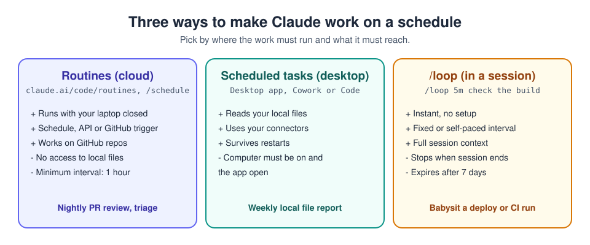

# 14. Routines and scheduled work

[Home](../README.md) | Previous: [CLAUDE.md files](13-claude-md.md) | Next: [Harness engineering](15-harness-engineering.md)


<sub>Photo: Nathan Dumlao on Unsplash</sub>

Some work should happen without you typing a prompt: a nightly review of
new pull requests, a Monday summary, a check after every deploy. Claude
offers three ways to do this.



| | Routines | Desktop scheduled tasks | `/loop` |
|---|---|---|---|
| Runs on | Anthropic's cloud | Your computer | Your open session |
| Computer must be on? | No | Yes | Yes |
| Local files | No (clones GitHub repos) | Yes | Yes |
| Triggers | Schedule, API call, GitHub event | Schedule | Interval |
| Minimum interval | 1 hour | 1 minute | 1 minute |
| Lasts | Until you delete it | Until you delete it | The session (max 7 days) |

## Routines (Claude Code in the cloud)

A **routine** is a saved Claude Code setup: a prompt, one or more GitHub
repositories, a cloud environment and a set of connectors. It runs
automatically on Anthropic's infrastructure, so it works while your laptop
is closed. Routines are in research preview, on Pro, Max, Team and
Enterprise plans, with a daily cap on runs.

### Create one on the web, step by step

1. Go to [claude.ai/code/routines](https://claude.ai/code/routines) and
   click **New routine**. (In the desktop app: **Code** tab >
   **Routines** > **New routine** > **Cloud**.)
2. **Name** it and write the **prompt**. It runs unattended, so make the
   prompt self-contained: what to do, where, and what success looks like.
   Choose the model in the prompt box.

   ```text
   Review every pull request opened in the last 24 hours that is not a
   draft. For each one, check for missing tests, unhandled errors and
   obvious security issues (secrets, injection). Leave one summary comment
   per PR with at most five findings, most important first. Do not approve,
   merge or push anything.
   ```

3. **Select repositories.** Each run clones them from the default
   branch. Claude pushes only to branches starting with `claude/`.
4. **Select an environment.** The **Default** environment allows common
   package registries and developer sites. Add domains or environment
   variables only if the routine needs them.
5. **Select a trigger** (you can add several):
   - **Schedule** - hourly, daily, weekdays, weekly, or a one-off time.
     Tip: pick a few minutes past the hour (9:07, not 9:00) for a prompt
     start.
   - **GitHub event** - for example pull request opened, or release
     published, with filters (base branch, labels, draft status...).
     Requires the Claude GitHub App on the repo.
   - **API** - a URL plus a bearer token, so another system (monitoring,
     deploy pipeline) can start the routine. The token is shown **once**;
     store it in a secret manager.
6. **Review connectors.** All your connectors are included by default.
   **Remove every one the routine does not need**: a routine can use them,
   including writes, without asking.
7. Click **Create**. Use **Run now** to test it immediately.
8. Open the run to read what Claude actually did. A green status only
   means the session ran, not that the task succeeded.

### From the CLI

```text
/schedule daily PR review at 9am
/schedule tomorrow at 9am, summarise yesterday's merged PRs
/schedule list
/schedule update
/schedule run
```

`/schedule` asks follow-up questions (repos, prompt, timing) and saves the
routine to your account. It requires signing in with a claude.ai plan
(not an API key). API triggers are added on the web.

### Routine safety

- A routine **runs without permission prompts** and acts as **you**:
  commits, PR comments and connector actions carry your identity.
- Give it only the repositories, network access and connectors it needs.
- Tell it explicitly what it must **not** do (merge, delete, push to main).
- Text sent to an API trigger is treated as untrusted data; the routine's
  own prompt decides whether to act on it.
- Review the first few runs before relying on it.

## Desktop scheduled tasks (on your machine)

Use these when the job needs **local files** or apps on your computer.

1. In the desktop app, open **Scheduled** in the sidebar (or **Code** tab >
   **Routines** > **New routine** > **Local**) and click **New task**, or
   type `/schedule` in a Cowork conversation.
2. Choose **Create with Claude** or **Set up manually**: name, prompt,
   approval mode, frequency, model and working folder.
3. **Save.** Past runs are listed for review.

Example prompt:

```text
Every Friday at 16:00: look in my "Downloads" folder for files older than
14 days, and write downloads-report.md listing them by type and size with a
suggestion (keep, archive, or probably safe to delete). Don't move or
delete anything.
```

The computer must be awake and the app available at run time.

## `/loop` (inside a session)

For short-lived watching while you work:

```text
/loop 5m check whether the CI run on this branch has finished and tell me the result
/loop keep an eye on the deploy and fix anything that breaks
```

With an interval, it repeats on that schedule. Without one, Claude picks
the pace itself. It ends when the session ends and expires after 7 days.

## Pattern: review in the morning what shipped overnight

The goal of unattended work is to change your job from *watching* Claude
to *reviewing* its results. A setup that makes that safe:

1. **Write the work down.** Use the interview-then-spec workflow
   ([chapter 10](10-claude-code.md#workflows-that-work)) to produce a
   `SPEC.md` (or a set of well-written GitHub issues) with clear scope and
   a verification step.
2. **Give it a check.** Tests, lint and build commands named in
   `CLAUDE.md`, so each run can prove its work.
3. **Create a routine** with a prompt like:

   ```text
   Pick the oldest open issue labelled "ready-for-claude". Implement it on
   a new claude/ branch following CLAUDE.md, run the tests and lint until
   they pass, and open a draft PR that links the issue and includes the
   test output. If you get stuck or the issue is unclear, comment on the
   issue with your questions instead of guessing. One issue per run.
   ```

4. **Limit the blast radius.** Only the repositories and connectors it
   needs; it can only push `claude/` branches; branch protection on `main`.
5. **Review in the morning.** Read each draft PR and its evidence, then
   merge, request changes, or close. Improve the spec template and
   `CLAUDE.md` based on what went wrong.

See [chapter 15](15-harness-engineering.md) for why each of these parts
matters.

## Try it now (10 minutes)

1. Pick a GitHub repository you own (a personal test repo is ideal).
2. Create a routine with the PR-review prompt above, a **one-off** schedule
   for 10 minutes from now, and **no connectors**.
3. Open a small pull request in that repo.
4. When the run finishes, open it and read what Claude did.
5. **Done when:** the PR has one summary comment, and nothing was merged or
   pushed.

---
[Home](../README.md) | Previous: [CLAUDE.md files](13-claude-md.md) | Next: [Harness engineering](15-harness-engineering.md)
