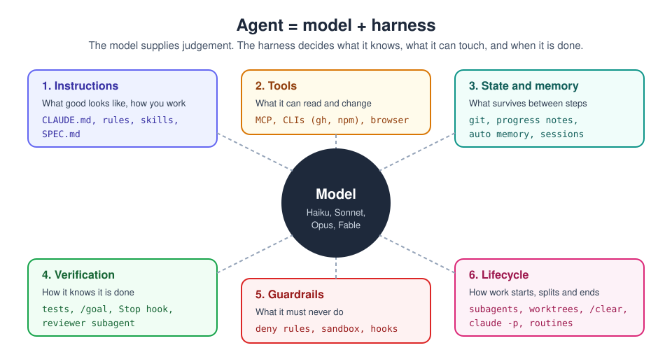

# 15. Harness engineering: making agents reliable

[Home](../README.md) | Previous: [Routines](14-routines.md) | Next: [Practice](16-practice.md)

Photo: Tim Mossholder on Unsplash

When an agent gives flaky results, the first instinct is to rewrite the
prompt or pay for a bigger model. Usually the better fix is the
**harness**: everything around the model that decides what it knows, what
it can touch, how it remembers, and how it proves it is finished.

Claude Code *is* a harness, and a configurable one. This chapter maps the
parts of a harness onto the features from earlier chapters, so you can
diagnose problems systematically instead of by trial and error.

## The six parts

| Part | Question it answers | In Claude Code |
|---|---|---|
| **1. Instructions** | What does "good" look like here? | `CLAUDE.md`, `.claude/rules/`, skills, a written `SPEC.md` ([ch. 13](13-claude-md.md), [ch. 8](08-skills.md)) |
| **2. Tools** | What can it read and change? | Built-in file and shell tools, MCP servers, CLIs like `gh`, the browser ([ch. 10](10-claude-code.md)) |
| **3. State and memory** | What survives between steps and sessions? | Git history, progress files, auto memory, named sessions (`/rename`, `--resume`) |
| **4. Verification** | How does it know it is done, and done correctly? | Tests and builds, `/goal`, Stop hooks, a reviewer subagent, `/code-review` |
| **5. Guardrails** | What must never happen? | Permission modes, deny rules, sandboxing, `PreToolUse` hooks ([ch. 12](12-plan-mode.md)) |
| **6. Lifecycle** | How does work start, split and end? | Plan mode, subagents, worktrees, `/clear` and `/compact`, `claude -p`, routines ([ch. 14](14-routines.md)) |

## Diagnose by symptom, fix the harness

| Symptom | Weak part | Fix |
|---|---|---|
| Ignores your conventions | Instructions | Put the rule in `CLAUDE.md` (short!) or a path-scoped rule; if it must *always* happen, make it a hook. |
| Solves the wrong problem | Instructions / lifecycle | Interview first and write a `SPEC.md`; use plan mode before coding. |
| Says "done" but it is broken | Verification | Give it a command that returns pass/fail and tell it to iterate until it passes. Ask for the evidence (test output), not a claim. |
| Makes things up about the code or data | Tools | Give it a way to *look*: file access, a CLI, an MCP server, the docs URL. |
| Forgets earlier decisions in long runs | State | Keep a progress file (for example `PROGRESS.md`) and commit often; start fresh sessions from the spec. |
| Quality drops as the session grows | Lifecycle | `/clear` between tasks; push research into subagents; split big jobs. |
| Does something risky | Guardrails | Deny rules for the dangerous commands and secret files; Manual or plan mode for sensitive work. |
| Too slow or too expensive | Lifecycle / model | Smaller model for mechanical subtasks, fan-out with `claude -p`, keep always-loaded context lean. |

## Building a minimal harness for a repo, step by step

1. **Instructions:** run `/init`, then cut `CLAUDE.md` down to build/test
   commands, conventions and "never do" items.
2. **Verification:** make sure there is one command that proves the code
   works (for example `npm test && npm run lint`) and name it in
   `CLAUDE.md`: `Before saying you're done, run npm test and npm run lint
   and fix failures.`
3. **Guardrails:** add deny rules for secrets and destructive commands to
   `.claude/settings.json` ([ch. 12](12-plan-mode.md#permission-rules)).
4. **Deterministic checks:** add a hook that formats or lints after every
   edit ([ch. 10](10-claude-code.md#subagents-and-hooks-briefly)).
5. **State:** for multi-session work, ask Claude to keep `PROGRESS.md`
   updated (what's done, what's next, open questions) and to commit after
   each working step.
6. **Review:** add a read-only reviewer subagent in
   `.claude/agents/reviewer.md`, or use `/code-review` before each PR.
7. **Test the harness, not just the output:** run the same task twice from a
   fresh session. If results differ a lot, find which part above is
   missing.

## Stop conditions for unattended work

A harness is what lets you walk away. Before leaving an agent to run (auto
mode, `claude -p`, or a routine), make sure it has:

- a **spec** that says what is in and out of scope,
- a **check** it must pass before stopping (tests, build, `/goal`),
- **guardrails** that block anything irreversible,
- a **place to report** (a PR, an issue, a summary file), and
- a **small blast radius**: its own branch or worktree, only the connectors
  it needs.

Then your job in the morning is to review evidence, not to redo the work.

## Further reading

- [Claude Code best practices](https://code.claude.com/docs/en/best-practices)
- [How Claude Code works](https://code.claude.com/docs/en/how-claude-code-works)
- [Prompting best practices: agentic systems](https://platform.claude.com/docs/en/build-with-claude/prompt-engineering/claude-prompting-best-practices)

---
[Home](../README.md) | Previous: [Routines](14-routines.md) | Next: [Practice](16-practice.md)
