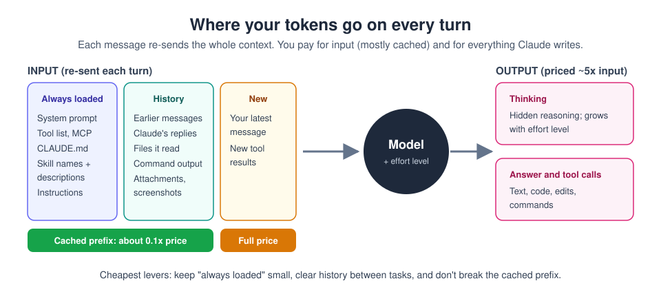
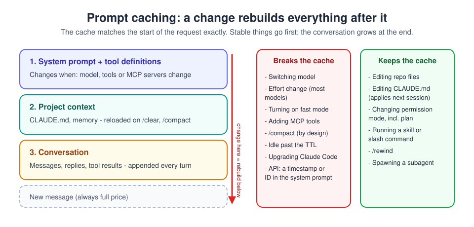

# 16. Costs, usage limits and prompt caching

[Home](../README.md) | Previous: [Harness engineering](15-harness-engineering.md) | Next: [Practice](17-practice.md)


<sub>Photo: Nathan Dumlao on Unsplash</sub>

> **Prices change.** Figures here are list prices as of September 2026.
> Always check [claude.com/pricing](https://claude.com/pricing) (plans)
> and [the API pricing page](https://platform.claude.com/docs/en/about-claude/pricing)
> before budgeting.

## Two ways you pay

| | Subscription (Free, Pro, Max, Team, Enterprise) | API / Console (pay as you go) |
|---|---|---|
| You pay | A monthly fee per person | Per token used |
| Limits | Usage allowance that resets on a rolling window (about five hours) and weekly; shared across chat, Cowork and Claude Code | Spend limits and rate limits you set per workspace |
| Over the limit | Wait for the reset, or turn on **usage credits** to keep going at API rates | You keep paying per token until a limit you set |
| Check usage | **Settings > Usage** on claude.ai; `/usage` in Claude Code | [Console usage page](https://platform.claude.com/usage); `/usage` in Claude Code |

On a subscription you do not see a per-message price, but everything below
still matters: the same habits that cut an API bill make your allowance last
much longer.

## What a token is, and where they go

A token is a chunk of text, roughly three-quarters of an English word. You
are charged (or your allowance is used) for **input tokens** Claude reads and
**output tokens** it writes. Output costs about five times more than input.



The key fact: **a model has no memory between messages.** Every time you
send a message, the whole conversation is sent again: system instructions,
tool definitions, `CLAUDE.md`, every earlier message, every file Claude read,
every command output, plus your new message. A one-line question at the end
of a three-hour session can cost more than the first hour of messages
combined, because it carries all of that history.

Things that quietly add input tokens:

- Long conversations that are never cleared.
- Big files, PDFs, logs and screenshots (they stay in history).
- Many connectors, plugins and skills (their names and descriptions are
  listed on every turn; full content loads only when used).
- A long `CLAUDE.md` (sent every session).

Things that add output tokens:

- **Thinking.** Higher effort means more hidden reasoning, billed as output.
- Long answers you did not need. Ask for the length you want.

## Choosing a model is the biggest lever

API list prices per million tokens (September 2026):

| Model | Input | Output | Cache read | Good for |
|---|---|---|---|---|
| Claude Haiku 4.5 | $1 | $5 | $0.10 | High-volume, simple, checkable jobs |
| Claude Sonnet 5.5 | $2 | $10 | $0.20 | Everyday work and most coding |
| Claude Opus 5.5 | $4 | $20 | $0.20 | Hard reasoning, long agentic tasks |
| Claude Fable 5.1 | $10 | $50 | $0.25 | The most demanding problems |

Guidelines:

- Start on Sonnet or Opus; go up only when a task is genuinely hard.
- Use Haiku (or a lower effort level) for subagents doing searches, simple
  edits or classification.
- **Judge cost per finished task, not per message.** A cheaper model that
  needs three extra rounds of corrections is not cheaper.
- **Effort** trades thoroughness for tokens on the same model. `low` or
  `medium` is often enough for routine work; save `high` and above for hard
  problems.

## Prompt caching, explained

Because every turn re-sends the same beginning (instructions, tools,
earlier conversation), Anthropic's API can **cache** that beginning. If the
start of a new request exactly matches something processed recently, it is
read from cache instead of being processed again. That is:

- **Cheaper:** a cache read costs about a tenth of the normal input price or
  less (see the table above).
- **Faster:** the first token of the reply arrives sooner.

Writing to the cache costs a little extra: **1.25x** the input price for the
default 5-minute cache, **2x** for the 1-hour cache. Each read resets the
timer, so a conversation you keep working in stays cached.

### It is a prefix match



The cache matches the request **from the start**, exactly. Anything that
changes early in the request forces everything after it to be processed
again at full price. That is why tools order requests from most stable to
least stable: system prompt and tools, then project context, then the
conversation, then your new message.

### A worked example

A Claude Code session on Sonnet 5.5 carries 50,000 tokens of context, and
you send 20 more messages (ignoring the small new part of each):

| | Calculation | Input cost |
|---|---|---|
| Without caching | 20 x 50,000 tokens x $2 per million | **$2.00** |
| With caching | one write (50,000 x $2.50 per million) + 19 reads (950,000 x $0.20 per million) | **about $0.32** |

Same work, about 84% less input cost. Now imagine switching model halfway:
the new model has no cache, so the next turn pays full price for all 50,000
tokens again.

### What breaks and what keeps the cache in Claude Code

From Anthropic's [Claude Code prompt caching guide](https://code.claude.com/docs/en/prompt-caching):

| Breaks the cache (next turn is slower and costs more) | Keeps the cache |
|---|---|
| Switching model with `/model` (each model has its own cache) | Editing files in the repo |
| Changing effort on most models (Opus 5.5, Sonnet 5.5 and Fable 5.1 keep it on a subscription or API key) | Editing `CLAUDE.md` (the change applies after `/clear` or restart) |
| Turning on fast mode (once per conversation) | Changing permission mode, including plan mode (unless you use `opusplan`, which switches model) |
| Adding tools when they load up front (with the default tool search, connecting an MCP server mid-session is fine) | Running a skill or slash command (unless it names a different model) |
| `/compact` (by design: history is replaced by a summary) | `/rewind` (it returns to a prefix that is already cached) |
| Going idle past the cache lifetime | Spawning a subagent (it builds its own cache; yours is untouched) |
| Upgrading Claude Code (first session after restart rebuilds) | Changing output style |

**Cache lifetime in Claude Code:** one hour for your main conversation on a
subscription within your plan's usage; five minutes on usage credits, API
keys and cloud providers (you can set `promptCacheTtl` to `1h`). After a
long break, the first message back reprocesses everything.

**Check it:** `/usage` shows a `Prompt cache (main)` line with the share of
input served from cache, the number of misses, the likely cause of the
last miss, and whether the cache is still warm.

### Caching in your own apps (Claude API)

If you build on the API, caching is something you switch on. The simplest
form caches automatically up to the last block of the request:

```python
import anthropic

client = anthropic.Anthropic()  # reads ANTHROPIC_API_KEY from env

with open("store-policies.txt", encoding="utf-8") as f:
    long_document = f.read()

instructions = "Answer using only this document:\n" + long_document

response = client.messages.create(
    model="claude-sonnet-5-5",
    max_tokens=2000,
    cache_control={"type": "ephemeral"},  # automatic, 5-minute TTL
    system=[{"type": "text", "text": instructions}],
    messages=[
        {"role": "user", "content": "What is the refund policy?"},
    ],
)

usage = response.usage
print("written to cache:", usage.cache_creation_input_tokens)
print("read from cache: ", usage.cache_read_input_tokens)
print("uncached input:  ", usage.input_tokens)
```

Run the same request twice within five minutes: the second call should show
`cache_read_input_tokens` close to the document size.

Rules of thumb for API caching:

- **Keep the start frozen.** Do not put the current time, a request ID or a
  user name in the system prompt; put changing details later, in the
  messages.
- **Keep tools and model fixed** for the whole conversation, and list tools
  in a consistent order.
- **Mind the minimum.** Very short prompts are not cached (the minimum is
  512 to 4,096 tokens depending on the model), and you get no error, just no
  cache.
- **Choose the TTL by the gap between requests:** under five minutes, the
  default is cheaper; longer, idle gaps may justify `"ttl": "1h"`.
- **Verify** with `cache_read_input_tokens`. If it stays at zero on repeated
  requests, something in the prefix is changing.

Full reference: [Prompt caching](https://platform.claude.com/docs/en/build-with-claude/prompt-caching).

### Batch API: half price if you can wait

For work that does not need an immediate answer (overnight classification,
bulk summaries, evaluations), the **Message Batches API** processes requests
asynchronously at **50% of the normal price**, and it combines with caching.

## Spend less: a checklist

**Everywhere**

- [ ] Write specific prompts; vague ones make Claude read and write more.
- [ ] Ask for the length you need ("five bullets", "under 200 words").
- [ ] Start a new chat for a new topic instead of continuing a long one.
- [ ] Put reusable context in a project or skill instead of pasting it again.

**Claude Code**

- [ ] Pick the model and effort **at the start** of the session and leave
  them.
- [ ] `/clear` between unrelated tasks (`/rename` first if you want to come
  back).
- [ ] Prefer `/rewind` over `/compact` when abandoning a wrong path; compact
  at natural breaks.
- [ ] Keep `CLAUDE.md` under about 200 lines; move procedures into skills.
- [ ] Disable MCP servers and plugins you are not using (`/mcp`, `/plugin`);
  prefer CLIs like `gh`.
- [ ] Push noisy work (tests, logs, searches) into subagents, on a cheaper
  model where possible.
- [ ] Use hooks to trim big outputs (for example, only failing test lines).
- [ ] Use plan mode on big changes to avoid expensive rework.
- [ ] Check `/usage` and `/context` when a session feels slow or heavy.

**Routines, loops and automation**

- [ ] Scheduled tasks and `/loop` re-send the whole context every time they
  fire. Keep their sessions small and their intervals sensible.
- [ ] Check the loops section of `/usage` for heavy recurring tasks.
- [ ] Batch non-urgent API work.

## Try it now (10 minutes)

1. In Claude Code, open any project and run `/usage`. Note the total cost
   (or plan usage) and the `Prompt cache (main)` line.
2. Ask three short questions about the code. Run `/usage` again: most
   input should now come from cache.
3. Run `/context` and find what takes the most space (system prompt,
   tools, `CLAUDE.md`, conversation).
4. Switch model with `/model` (Claude Code asks you to confirm while the
   cache is warm), ask one more question, and check `/usage` again. You
   should see a cache miss.
5. `/clear` and compare the next turn's cost.

**Done when:** you can explain, from your own `/usage` output, what a cache
miss costs you and which habit you will change.

---
[Home](../README.md) | Previous: [Harness engineering](15-harness-engineering.md) | Next: [Practice](17-practice.md)
